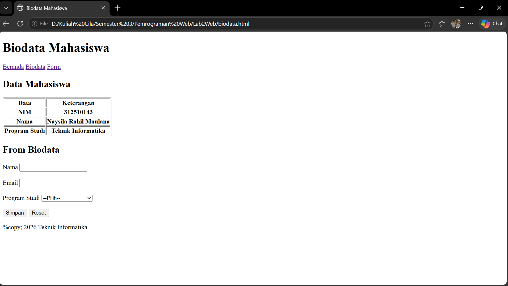
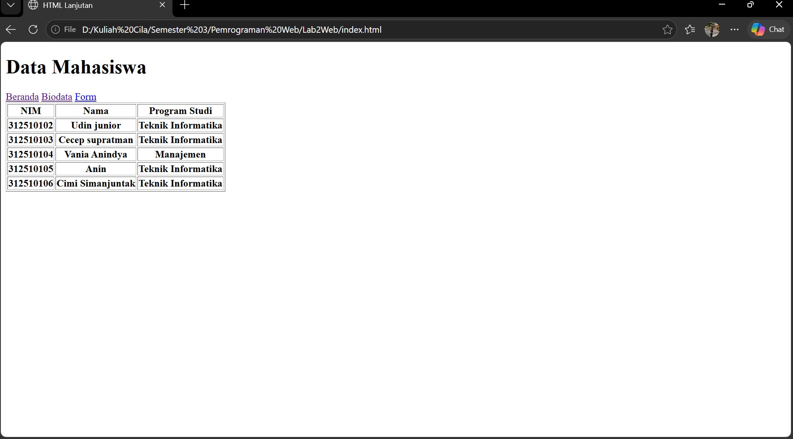
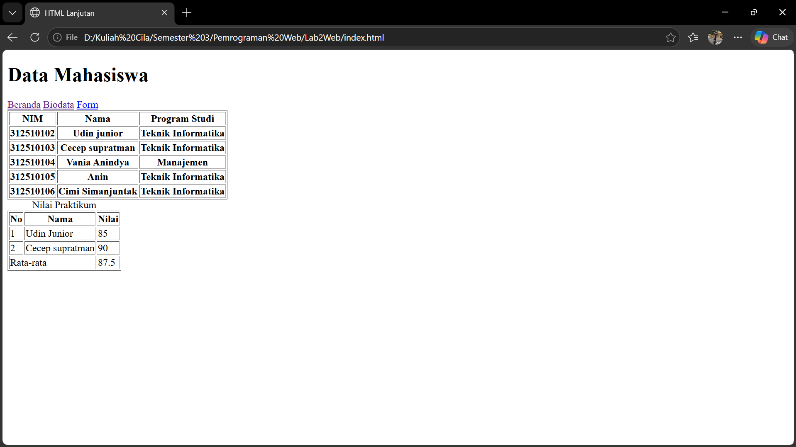
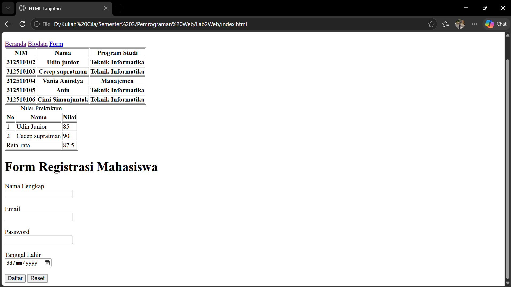
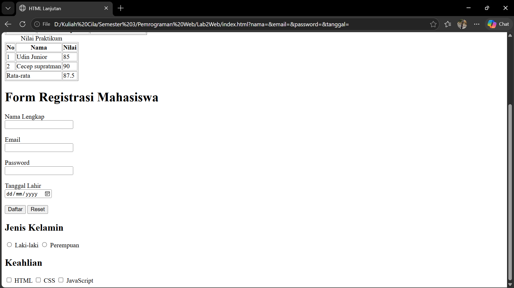

# Laporan Praktikum Pemrograman Web

## 1. Tujuan Praktikum
Praktikum ini bertujuan untuk memahami dasar-dasar pembuatan halaman web menggunakan HTML, mulai dari struktur dokumen, elemen form, tabel, media, hingga penerapan semantic HTML agar halaman lebih rapi, terstruktur, dan mudah dibaca.

## 2. Alat dan Bahan
- Laptop/PC
- Visual Studio Code
- Browser
- File HTML dan media yang tersedia dalam folder project

## 3. Hasil Praktikum

### 1. Halaman Biodata

Pada tahap ini dibuat halaman biodata sederhana yang menampilkan identitas mahasiswa secara rapi. Tujuannya agar mahasiswa memahami penggunaan elemen dasar HTML seperti heading, paragraf, dan list.

### 2. Data Mahasiswa

Pada bagian ini dibuat tabel data mahasiswa dengan beberapa kolom seperti NIM, nama, dan program studi. Tabel digunakan untuk menampilkan data secara terstruktur dan mudah dibaca.

### 3. Nilai Praktikum

Halaman ini menampilkan nilai praktikum dalam bentuk tabel. Penggunaan tabel headings, body, dan footer membantu memisahkan data utama dan ringkasan nilai secara lebih rapi.

### 4. Form Registrasi Mahasiswa

Pada tahap ini dibuat form pendaftaran mahasiswa dengan beberapa input seperti nama, email, password, tanggal lahir, dan pilihan program studi. Form ini menunjukkan cara kerja input dan elemen interaktif pada HTML.

### 5. Form Pendataan Mahasiswa

Pada bagian ini form dikembangkan dengan tambahan input lain seperti jenis kelamin dan keahlian. Hal ini menunjukkan bahwa HTML dapat digunakan untuk membuat form yang lebih lengkap dan bervariasi.

### 6. Form Registrasi Lengkap

Bagian ini merupakan pengembangan form sebelumnya dengan elemen lebih lengkap, termasuk textarea dan pilihan opsi. Form ini memperlihatkan bagaimana HTML dapat menangani berbagai jenis input data pengguna.

### 7. Media Audio dan Video

Pada tahap akhir, praktikum menambahkan media audio dan video ke dalam halaman. Ini digunakan untuk memahami cara menyisipkan file multimedia ke website agar konten lebih menarik dan interaktif.

## 4. Kesimpulan
Dari serangkaian praktikum ini dapat disimpulkan bahwa HTML merupakan fondasi utama dalam pembuatan halaman web. Dengan mempelajari struktur dokumen, tabel, form, dan media, kita dapat membuat halaman web yang lebih terstruktur, informatif, dan mudah dipahami. Penggunaan semantic HTML juga membantu meningkatkan keterbacaan kode dan aksesibilitas halaman.

## 5. Lampiran Media
- audio.mp3
- video.mp4

